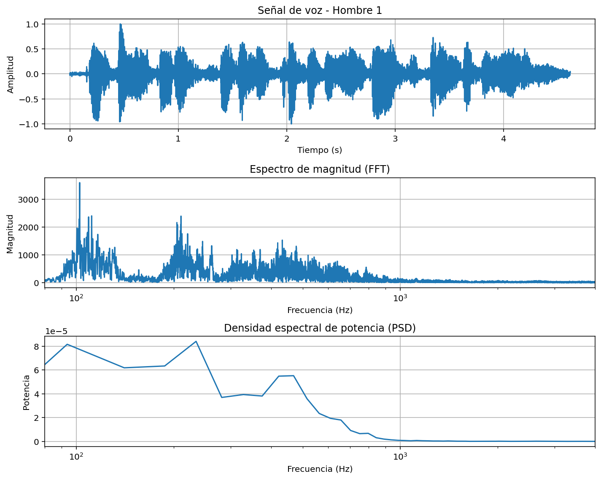
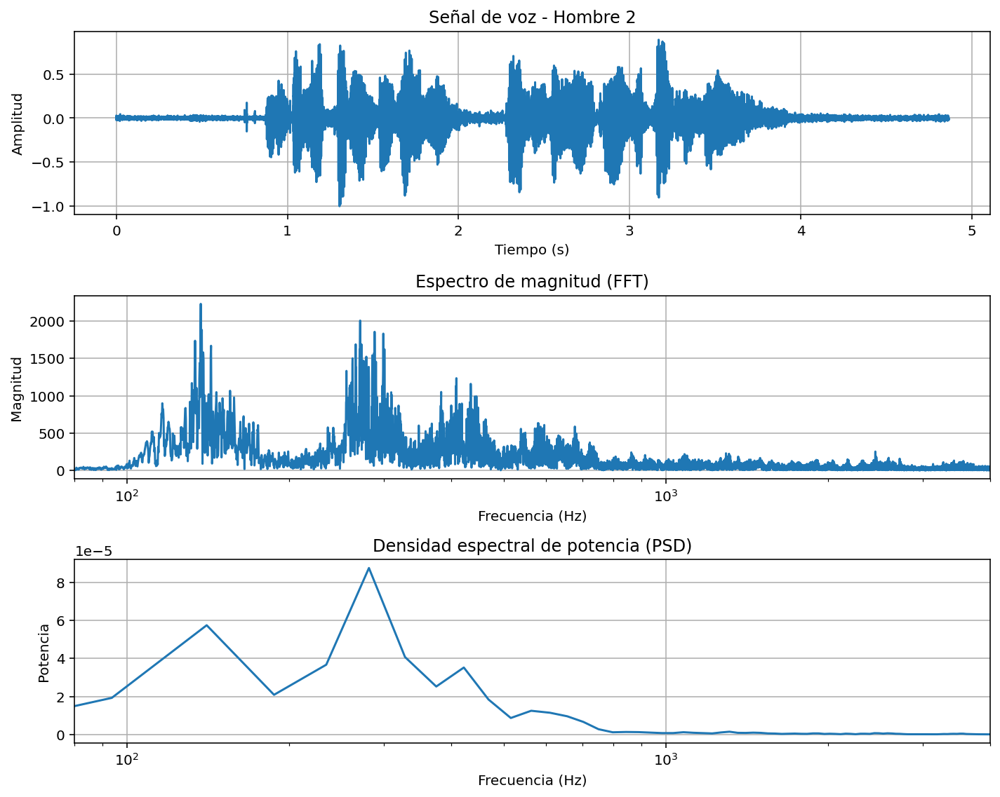
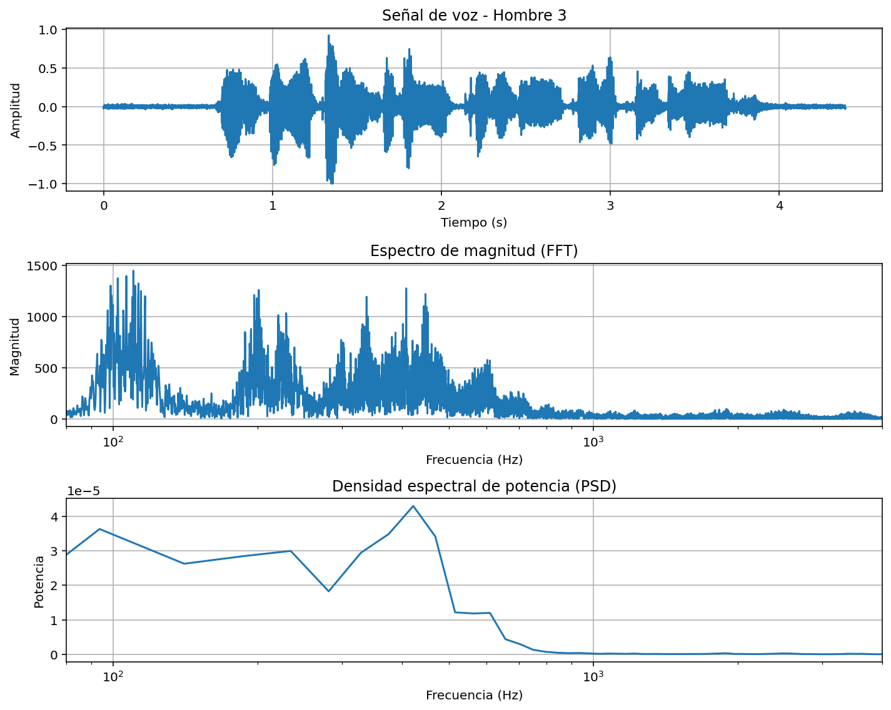
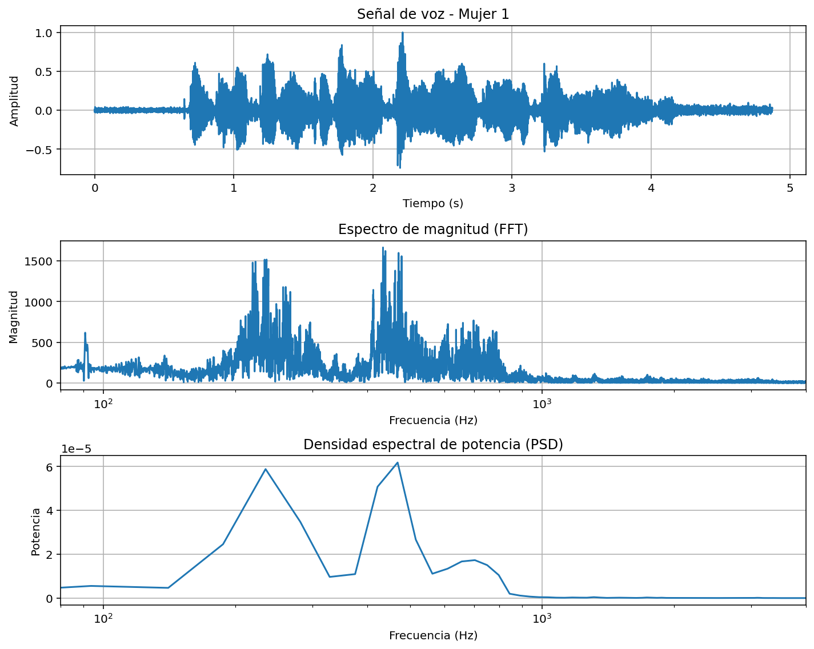
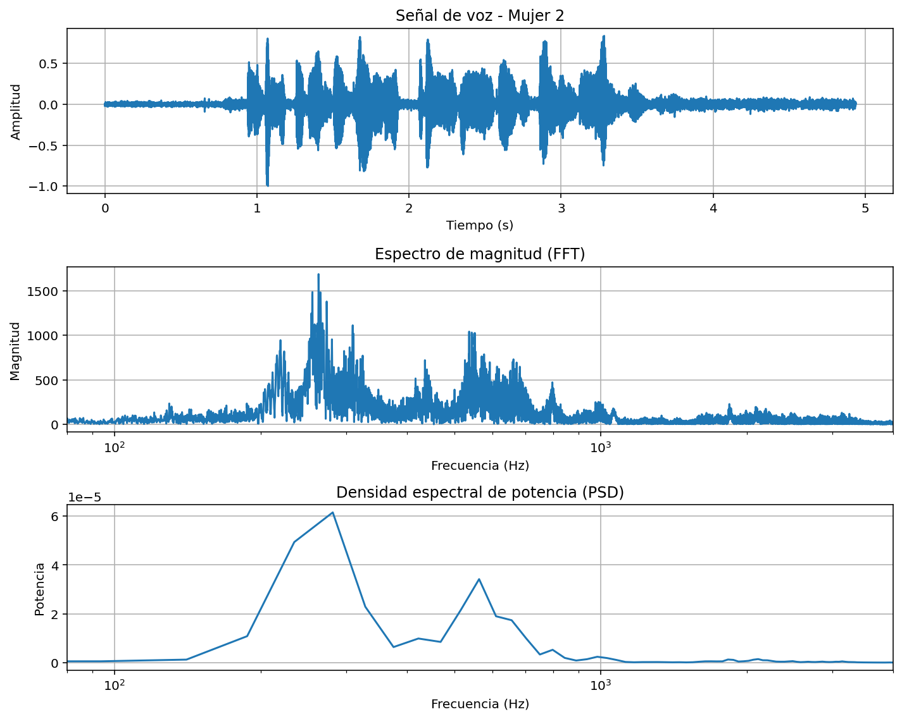
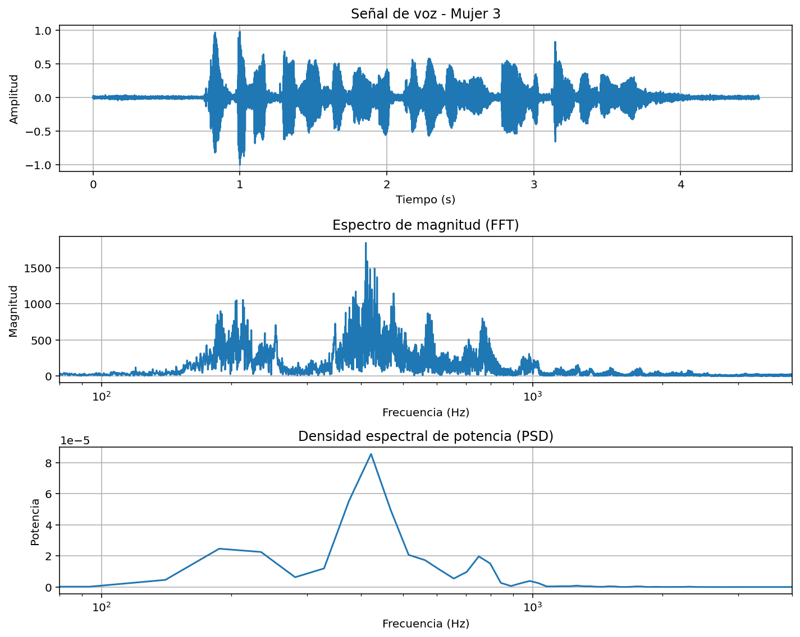
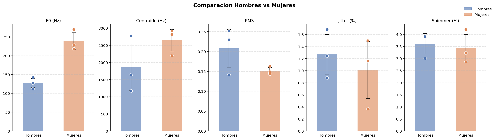

# Laboratorio 3
## Análisis espectral de la voz

**Programa:** Ingeniería Biomédica  
**Asignatura:** Procesamiento Digital de Señales
**Universidad:** Universidad Militar Nueva Granada  
**Estudiantes:** Danna Rivera, Duvan Paez

---

## Introducción
 
Las características espectrales desempeñan un papel fundamental en el análisis y comprensión de las señales de voz, ya que permiten identificar patrones fonéticos, rasgos del hablante y diferencias fisiológicas entre géneros. En esta práctica se aplican herramientas de procesamiento digital de señales para extraer y comparar parámetros espectrales de voces masculinas y femeninas.

Los parámetros analizados son:
 
| Parámetro | Descripción |
|---|---|
| **F0 — Frecuencia fundamental** | Frecuencia más baja de la señal; define la altura tonal de la voz |
| **Centroide espectral** | Centro de masa del espectro; indica el brillo o timbre de la voz |
| **Intensidad RMS** | Energía promedio de la señal de voz |
| **Jitter relativo** | Variación ciclo a ciclo en la frecuencia fundamental |
| **Shimmer relativo** | Variación ciclo a ciclo en la amplitud de la señal |
 
El **jitter** y el **shimmer** son indicadores de estabilidad vocal; en voces sanas sus valores típicos son ≤ 1% y ≤ 3–5% respectivamente. Valores elevados pueden estar asociados a ruido de grabación, condiciones acústicas deficientes o patologías vocales.
 
---

## PARTE A – Adquisición de las señales de voz

### Adquisición de señales
Se grabaron 6 señales de voz (3 hombres, 3 mujeres) pronunciando la misma frase corta (~5 segundos) en condiciones de bajo ruido ambiental, usando el micrófono de teléfonos inteligentes. Todos los archivos se guardaron en formato `.wav` con la misma frecuencia de muestreo.

 ### Procesamiento en Python
 
El análisis se realizó con las siguientes bibliotecas:
 
```python
import numpy as np
import matplotlib.pyplot as plt
import scipy.signal as signal
import scipy.io.wavfile as wav
import pandas as pd
```

#### 1. Eliminación de silencios
Cada señal fue normalizada entre −1 y 1, y se eliminaron los silencios al inicio y al final mediante un umbral de amplitud:
 
```python
def eliminar_silencio(audio, threshold=0.02):
    idx = np.where(np.abs(audio) > threshold)[0]
    if len(idx) == 0:
        return audio
    return audio[idx[0]:idx[-1]]
```

#### 2. Transformada de Fourier (FFT) y PSD
Se calculó el espectro de magnitud mediante FFT y la densidad espectral de potencia con el método de Welch (`nperseg=1024`):
 
```python
fft_audio = np.fft.fft(audio)
freqs     = np.fft.fftfreq(N, 1/fs)
magnitud  = np.abs(fft_audio)
 
f_psd, psd = signal.welch(audio, fs, nperseg=1024)
```

#### 3. Frecuencia fundamental (F0)
Se estimó mediante autocorrelación de la señal:
 
```python
def calcular_f0(audio, fs):
    corr  = signal.correlate(audio, audio)
    corr  = corr[len(corr)//2:]
    d     = np.diff(corr)
    start = np.where(d > 0)[0][0]
    peak  = np.argmax(corr[start:]) + start
    return f0
```

#### 4. Centroide espectral (Brillo)
Promedio ponderado de las frecuencias por su magnitud espectral, utilizado como estimador de la frecuencia media:
 
```python
centroide = np.sum(frec_pos * mag_pos) / np.sum(mag_pos)
```

#### 5. Intensidad RMS
```python
rms = np.sqrt(np.mean(audio**2))
```

### 6. Resultados obtenidos
#### 6.1 Gráficas generadas de señal de voz, Espectro de magnitud, Densidad espectral de potencia (de cada persona)

**Hombre 1:**


**Hombre 2:**


**Hombre 3:**


**Mujer 1:**


**Mujer 2:**


**Mujer 3:**


#### 6.2 Tabla de parámetros extraídos

| Audio | Género | F0 (Hz) | Centroide (Hz) | RMS | 
|---|---|---|---|---|
| hombre1 | M | 127.08 | 1170.72 | 0.229 | 
| hombre2 | M | 142.01 | 2774.47 | 0.142 | 
| hombre3 | M | 112.78 | 1643.45 | 0.252 | 
| mujer1  | F | 269.66 | 2203.74 | 0.143 | 
| mujer2  | F | 229.66 | 2918.23 | 0.162 | 
| mujer3  | F | 218.18 | 2821.79 | 0.149 | 
 
## PARTE B – Medición de Jitter y Shimmer

 #### Jitter y Shimmer
Se aplicó un filtro pasa-banda Butterworth de orden 4, con rangos diferenciados por género (80–400 Hz para hombres, 150–500 Hz para mujeres). Los ciclos vocales se detectaron sobre la envolvente de Hilbert:
 
```python
# Envolvente
audio_env = np.abs(signal.hilbert(audio_filtrado))
 
# Detección de picos (ciclos vocales)
peaks, _ = signal.find_peaks(audio_env, distance=int(fs/f0*0.8), prominence=0.01)
```
 
**1. Jitter relativo** (variación de periodo ciclo a ciclo):
 
$$Jitter_{rel} = \frac{\frac{1}{N-1}\sum_{i=1}^{N-1}|T_i - T_{i+1}|}{\frac{1}{N}\sum_{i=1}^{N}T_i} \times 100$$
 
```python
periodos   = np.diff(peaks) / fs
# Jitter_abs = (1/N-1) * Σ|Ti - Ti+1|
jitter_abs = np.mean(np.abs(np.diff(periodos)))
# Jitter_rel = Jitter_abs / mean(Ti) * 100
jitter_rel = (jitter_abs / np.mean(periodos)) * 100
```

**2. Shimmer relativo** (variación de amplitud ciclo a ciclo):
 
$$Shimmer_{rel} = \frac{\frac{1}{N-1}\sum_{i=1}^{N-1}|A_i - A_{i+1}|}{\frac{1}{N}\sum_{i=1}^{N}A_i} \times 100$$
 
```python
amplitudes  = audio_env[peaks]
# Shimmer_abs = (1/N-1) * Σ|Ai - Ai+1|
shimmer_abs = np.mean(np.abs(np.diff(amplitudes)))
# Shimmer_rel = Shimmer_abs / mean(Ai) * 100
shimmer_rel = (shimmer_abs / np.mean(amplitudes)) * 100
```

**3. Resultados obtenidos** 
| Audio | Género | Jitter (%) | Shimmer (%) |
|---|---|---|---|
| hombre1 | M |1.24 | 3.01 |
| hombre2 | M |1.68 | 3.93 |
| hombre3 | M |0.88 | 3.89 |
| mujer1  | F |1.50 | 2.86 |
| mujer2  | F |0.37 | 4.20 |
| mujer3  | F |1.16 | 3.23 |
---

## PARTE C – Comparación y conclusiones 

A partir de los resultados obtenidos, se identificaron diferencias claras entre las voces masculinas y femeninas en varios parámetros espectrales.



**Frecuencia fundamental (F0)**

Las voces masculinas presentan valores de frecuencia fundamental entre aproximadamente 112 Hz y 142 Hz, mientras que las voces femeninas están entre 218 Hz y 269 Hz. Este comportamiento coincide con lo esperado desde el punto de vista fisiológico, debido a que los hombres tienen cuerdas vocales más largas y gruesas, lo que produce vibraciones más lentas y una menor F0, mientras que las mujeres tienen cuerdas vocales más cortas y tensas, generando vibraciones más rápidas y una mayor F0.

**Centroide espectral (brillo)**

Se observa que las voces femeninas presentan un centroide espectral más alto, entre 2200 Hz y 2900 Hz, en comparación con los hombres, cuyos valores están entre 1100 Hz y 2700 Hz, esto indica que las voces femeninas concentran más energía en frecuencias altas, lo que se percibe como un sonido más brillante, por el contrario, las voces masculinas tienen un carácter más grave y menor contenido en altas frecuencias.

**Intensidad (RMS)**

En el RMS, no se observa una diferencia clara entre hombres y mujeres, los valores presentan variabilidad en ambos grupos, esto se puede deber a que la intensidad depende más de factores como la forma de grabación, la distancia al micrófono y la fuerza al hablar, que de características fisiológicas propias del género.

**Jitter y Shimmer**

Los valores de jitter y shimmer se mantienen en rangos relativamente bajos en la mayoría de las señales analizadas, algunos valores de jitter superan el 1%, mientras que el shimmer se mantiene cercano al rango típico de 3% a 5%. Estas variaciones pueden estar asociadas a ruido en la señal, condiciones de grabación o variaciones naturales de la voz, en general, no se evidencian irregularidades significativas en la estabilidad vocal.

---

## Importancia clínica del Jitter y Shimmer

El jitter y el shimmer son parámetros clave en el análisis clínico de la voz, ya que permiten evaluar la estabilidad en la vibración de las cuerdas vocales, el jitter mide la variación en la frecuencia entre ciclos consecutivos, mientras que el shimmer mide la variación en la amplitud de la señal.

En contextos clínicos, valores elevados de estos parámetros pueden estar asociados a trastornos como disfonías, alteraciones neurológicas o problemas en el control de la fonación. Por esta razón, son utilizados como herramientas de apoyo en el diagnóstico y seguimiento de patologías vocales.

Sin embargo, es importante considerar que estos parámetros son sensibles al ruido y a las condiciones de grabación, por lo que deben interpretarse junto con otros análisis acústicos y evaluación clínica.

---

## Análisis

Los resultados muestran que la frecuencia fundamental y el centroide espectral son los parámetros más relevantes para diferenciar voces masculinas y femeninas, estas diferencias están directamente relacionadas con la anatomía del sistema fonador, como la longitud y masa de las cuerdas vocales. Otros parámetros como RMS, jitter y shimmer aportan información complementaria.

La práctica tuvo de limitaciones que las grabaciones fueron realizadas con dispositivos no especializados, lo que puede introducir ruido en la señal, además, no se controlaron completamente variables como la distancia al micrófono o el entorno. 

---

## Preguntas de discusión 

**¿Cómo es la frecuencia fundamental de la densidad espectral de potencia asociada a una señal de voz masculina con respecto a la que se obtiene a partir de una señal de voz femenina, mayor o menor? ¿Qué hay del valor RMS?**

La frecuencia fundamental en las voces masculinas es menor que en las femeninas, lo cual se evidenció claramente en los resultados, esto se debe a diferencias anatómicas en las cuerdas vocales. En cuanto al RMS, no se observa una diferencia significativa entre géneros, ya que este parámetro depende principalmente de las condiciones de grabación.

**¿Qué limitaciones plantea el uso de características como shimmer y jitter para la detección de patologías como disartrias y afasias?**

El uso de jitter y shimmer para la detección de patologías presenta varias limitaciones importantes. Estos parámetros son altamente sensibles al ruido en la señal y a la calidad de la grabación, lo que puede generar valores elevados sin que exista una patología real, 
además, pueden verse afectados por factores no patológicos como la fatiga vocal, el estado emocional o la forma de pronunciación del hablante, por ello, no permiten establecer un diagnóstico por sí solos y deben complementarse con otros parámetros acústicos y evaluación clínica especializada.

---

## Conclusiones

La frecuencia fundamental se confirmó como el parámetro más determinante para la diferenciación entre voces masculinas y femeninas, mostrando una separación clara entre ambos grupos. El centroide espectral permitió identificar diferencias en el brillo de la señal entre voces masculinas y femeninas, evidenciando una mayor concentración de energía en altas frecuencias en las voces femeninas.

Por su parte, los valores de jitter y shimmer indicaron una adecuada estabilidad vocal en las grabaciones analizadas, manteniéndose en su mayoría dentro de rangos esperados. Esto sugiere que las señales de voz no presentan irregularidades significativas en la vibración de las cuerdas vocales.

En general, estos resultados demuestran que el análisis espectral es una herramienta útil no solo para la diferenciación de voces, sino también para la evaluación de la calidad y estabilidad de la señal.
